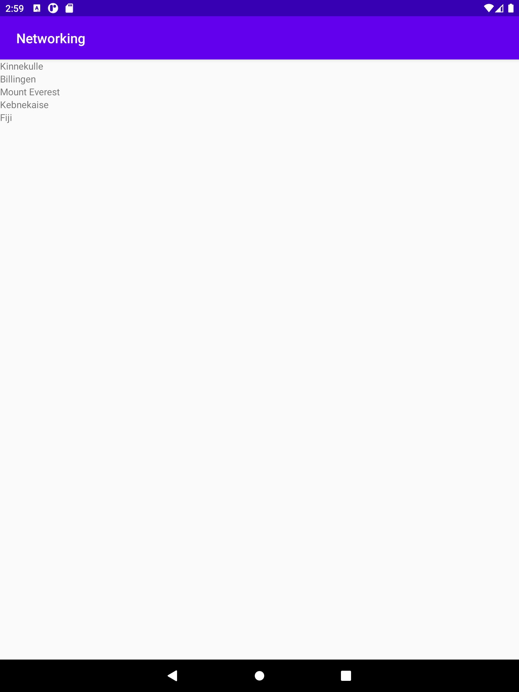

# Rapport

Först så skapades en Mountain.java class public klassen Mountain, i den så skrevs tre variablar 
(name, location och size) och som blir kallade av constructorn tack vare användningen av "this"
sedan så skapades getters och setters av dem. Det sista som skrivs i mountain klassen är en 
toString för att kunna hämta datan. sedan i post execute så skrevs parsing kod vilket listar antal 
element i mountain listan. 

Efter detta så lades det till user permisson till internet för att kunna använda internetet.
Sedan så lades länken till i JSON_URL och JsonTask(this).execute(JSON_URL); lades till.
Efter det så skapades en Adapter och Viewholder samt en recyclerview i activity_main och 
en item_mountain xml lista, med hjälp av dessa så kan vi printa ut på skärmen en lista med alla berg
vilket 

 I main activity klassen så gör man virablar för recycler view, list<company>
och en för adapter, i on create så referarar vi dem till sina idn i dem andra filerna,
recyclerView till recyclerview adapter till Adapter ect och så använder man en string
JSNO_URL på JSON data sidan, och en new JsonTask(this).execute(JSON_URL); för
att hämta datan från urln och skapa datan i appen. Man behöver en parser också,
den skrivs under i en onPostExecute(string json), i denna så skrivs Gson gson =
newe Gson();, Type type = new TypeToken<ArrayList<Company>>() {}.getType();,
company = gson.fromJson(json, type);, adapter.setCompany(Company);,
adapter.notifyuDataSetChanged();. detta kommer göra att datan kan parases.
Sedan så kan man skapa en ViewHolder klass vilket ska extendaas till
RecyclerView.ViewHolder, denna map ska innehålla Textview för de attributen du vill
få ut från JSON url’n, som t.ex public TextView CompanyName. den ska också
innehålla en super item view.
Man skapar också en Company klass, Denna så skapar skriver man dem attributen
man vill få ut från sidan, fast nu så skrivs dem inte för en textview, utan nu så skriver
man strings eller ints, demma kan se ut såhär: private String companyName;. sedan
så markerar du dem och trycker alt+insert och skapar en construction, sedan marker
allt igen fast väljer ‘getter och setter’.
du vill även skapa en Adapter klass, här så har du private List<Company> = company
= new ArrayList(); som vi pekar på ifrån main activity. här så vill du skriva en public
klass för View holder med onCreateViewHolder(@NonNull ViewGroup parent, int
viewType). I själva klassen så har man en return new som skapar
ViewHolder((LayoutInflater.from(parent.getContext()).inflate(R.layout.item_company,
parent, false)));. Det är viktigt att den pekar på din layout reasource file där du har
text viewn som vi och inte den som vi skriver recycler viewn i, i detta fall så kan vi
göra recycler viewn i activity_main. recycler viewn kommer hämta den datan och visa
den på skärmen. Du vill även skapa holders för attributen, det gör vi i Adapt.java i en
onBindViewHolder, dem kan se up ex:
holder.companyName.setText(company.getCompanyName());

```
    //Mountain.java
    public Mountain(String name, String location, int size) {
        this.name = name;
        this.location = location;
        this.size = size;
    }
    ...
    ...
    ...
    @Override
    public String toString() {
        return name + " has an altitude of " + size + "m above sea level";
    }
    
    //MainActivity.java
        new JsonFile(this, this).execute(JSON_FILE);
        //Fetch from url
        new JsonTask(this).execute(JSON_URL);

        recyclerView =findViewById(R.id.Recycle_view);
        recyclerView.setAdapter(new MyAdapter());
        recyclerView.setLayoutManager(new LinearLayoutManager(this));
    }
    
    //MyAdapter.java
    @Override
    public MyViewHolder onCreateViewHolder(@NonNull ViewGroup parent, int viewType) {
        View view = LayoutInflater.from(parent.getContext()).inflate(R.layout.item_mountain, parent, false);
        return new MyViewHolder(view);
    }
    
    //MyViewHolder.java
    public class    MyViewHolder extends RecyclerView.ViewHolder {
    public TextView name;

    public MyViewHolder(@NonNull View itemView) {
        super(itemView);
        name = itemView.findViewById(R.id.name);
    }
}
    
    
```

Bilder läggs i samma mapp som markdown-filen.



Läs gärna:

- Boulos, M.N.K., Warren, J., Gong, J. & Yue, P. (2010) Web GIS in practice VIII: HTML5 and the canvas element for interactive online mapping. International journal of health geographics 9, 14. Shin, Y. &
- Wunsche, B.C. (2013) A smartphone-based golf simulation exercise game for supporting arthritis patients. 2013 28th International Conference of Image and Vision Computing New Zealand (IVCNZ), IEEE, pp. 459–464.
- Wohlin, C., Runeson, P., Höst, M., Ohlsson, M.C., Regnell, B., Wesslén, A. (2012) Experimentation in Software Engineering, Berlin, Heidelberg: Springer Berlin Heidelberg.
